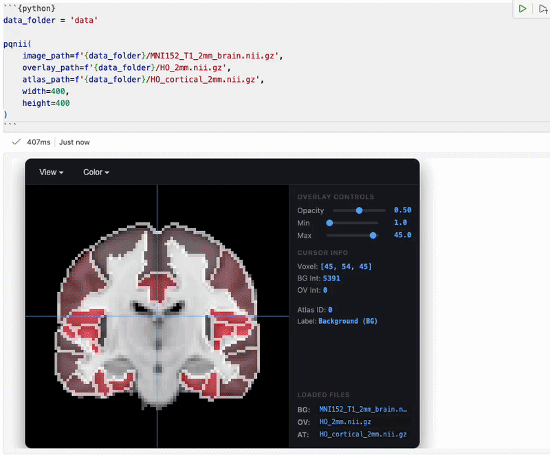
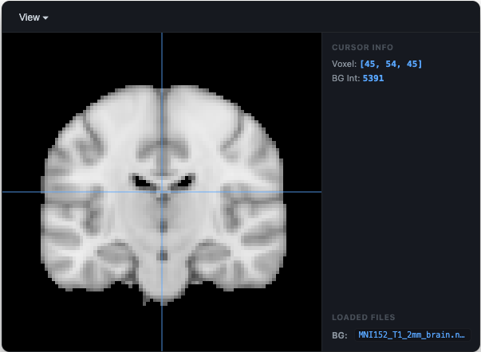
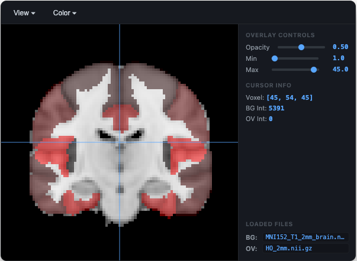
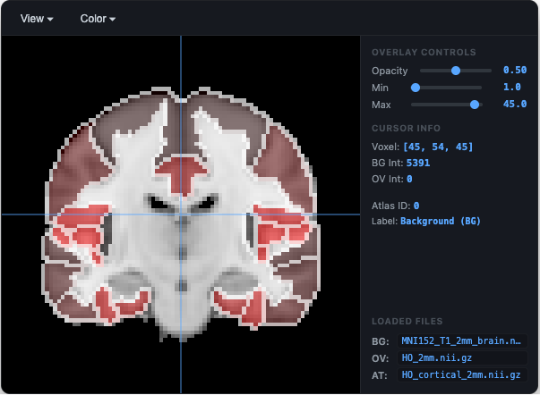
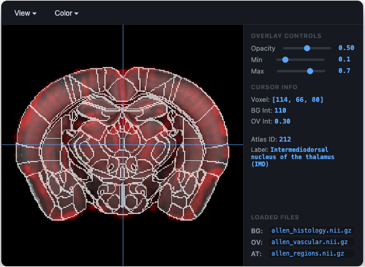

# pqnii: Lightweight Interactive NIfTI Viewer


LC 20260907

`pqnii` (to be read _picknee_) is a lightweight Python module for quick, interactive 2D slice visualization of NIfTI volumes (`.nii` / `.nii.gz`) directly inside Quarto reports (and maybe Jupyter Notebooks, but I didn't test it). The name was inspired by the need to "quickly peek into a nifti image in a quarto (notebook)".



## Motivation

I generate this - together with Gemini - instead of using the wonderful [niivue](https://niivue.com/) because I wanted a simple widget that could be used in [Quarto](https://quarto.org/) `.qmd` notebooks inside [Positron](https://positron.posit.co/) _and_ **generate a self-contained HTML version of the notebook with interactive usable viewers inside it** 🎻 with the aim of promoting and fostering literate programming and open data science in neuroimaging 🎻.

To see the final product, you can render the `runme.qmd` (once everything has been setup - see below) or open the `runme.html` in a browser.

---

## Features

* **Zero Heavy Dependencies**: Renders interactive HTML5 Canvas viewers directly in the notebook output cell.
* **Multi-Volume Support**: Display base structural images, functional/statistical overlays, and parcellation atlases simultaneously.
* **Region Inspection**: Inspect base intensities, overlay values, and region labels mapped automatically from `.labels` files.
* **Interactive Navigation**: Click and drag crosshairs, scroll through slices, and toggle between Coronal, Axial, and Sagittal views.
* **Safe Validation**: Automatically validates affine/dimension alignment and gracefully handles file errors.

---

## Installation

Read the [Disclaimer](#disclaimer) first.

Ensure you have `nibabel` and `numpy` installed:

```bash
pip install nibabel numpy
```

Copy the file `pqnii.py` (package will come next) and import the main viewer function in Python:

```python
from pqnii import pqnii
```

---

## Examples

### 0. Scrolling through slices
> [!TIP]
> In all the examples, use the mouse wheel or the tracking pad to scroll through slices.

### 1. Basic Single Structural Volume

Pass a single NIfTI file path to quickly inspect a structural scan.

```python
data_folder = 'data'

pqnii(
    image_path=f'{data_folder}/MNI152_T1_2mm_brain.nii.gz',
    width=400,
    height=400
)
```



---

### 2. Base Image with Overlay

Add a statistical or functional mask overlay on top of your structural base image. You can adjust the opacity and min/max thresholds dynamically in the UI sidebar.

```python
data_folder = 'data'

pqnii(
    image_path=f'{data_folder}/MNI152_T1_2mm_brain.nii.gz',
    overlay_path=f'{data_folder}/HO_2mm.nii.gz',
    width=400,
    height=400
)
```



---

### 3. Full Visualization (Base + Overlay + Atlas)

Load a base anatomical image, an overlay layer, and a parcellation atlas. The viewer automatically renders crisp region outlines and displays mapped label names in the sidebar.

```python
data_folder = 'data'

pqnii(
    image_path=f'{data_folder}/MNI152_T1_2mm_brain.nii.gz',
    overlay_path=f'{data_folder}/HO_2mm.nii.gz',
    atlas_path=f'{data_folder}/HO_cortical_2mm.nii.gz',
    width=400,
    height=400
)
```



---

### 4. High-Resolution Volumes (e.g., Allen Brain Atlas)

Use the `max_dim` parameter to control downsampling for smoother browser rendering performance when displaying high-resolution datasets.

```python
data_folder = 'data'

pqnii(
    image_path=f'{data_folder}/allen_histology.nii.gz',
    overlay_path=f'{data_folder}/allen_vascular.nii.gz',
    atlas_path=f'{data_folder}/allen_regions.nii.gz',
    max_dim=256
)
```



---

## API Reference

`pqnii(image_path, overlay_path=None, atlas_path=None, labels_path=None, width=400, height=400, colormap="red", max_dim=128)`

**Parameters:**

* **`image_path`** *(str or Path)*: Path to the primary background NIfTI image.
* **`overlay_path`** *(str or Path, optional)*: Path to an overlay volume (e.g., statistical map).
* **`atlas_path`** *(str or Path, optional)*: Path to a discrete atlas volume for region boundary outlines.
* **`labels_path`** *(str or Path, optional)*: Path to a `.labels` JSON file mapping region IDs to names. Defaults to searching `<atlas_name>.labels` in the atlas directory.
* **`width`** *(int)*: Canvas width in pixels (default: `400`).
* **`height`** *(int)*: Canvas height in pixels (default: `400`).
* **`colormap`** *(str)*: Default colormap for overlay (`"red"`, `"green"`, `"blue"`, `"hot"`, `"cool"`, `"rainbow"`).
* **`max_dim`** *(int)*: Maximum dimension size along any axis for performance downsampling (default: `128`).

## Disclaimer
MOST OF THE CODE WAS PRODUCED BY GEMINI. I USED MY EXPERIENCE IN NEUROIMAGING TO DRIVE IT, BUT IT CAN BREAK. I JUST WANTED A SIMPLE VIEWER TO USE IN QUARTO NOTEBOOKS. USE IT AT YOUR OWN RISK. I DECLINE ANY RESPONSIBILITY FOR WHATEVER YOU MIGHT DO WITH THIS CODE.

The MNI and the atlas come from an [FSL](https://fsl.fmrib.ox.ac.uk/fsl/docs/) installation. You can used them according to their [license](https://fsl.fmrib.ox.ac.uk/fsl/docs/license.html).

Also, right now everything is inside the `pqnii.py` file. I know it's not good practice to write a script with 600+ lines of code instead of a proper modular architecture. But now I do not have time for it, and I need the tool. Please understand.

